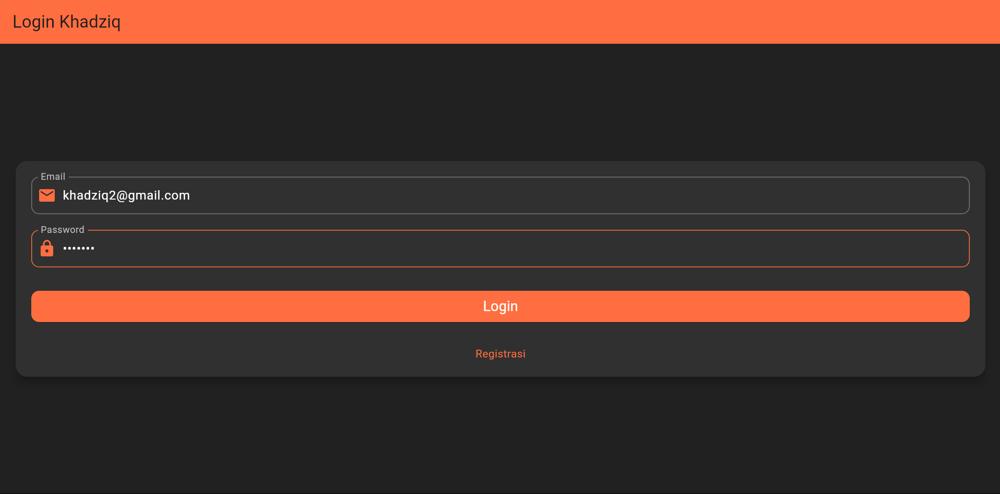
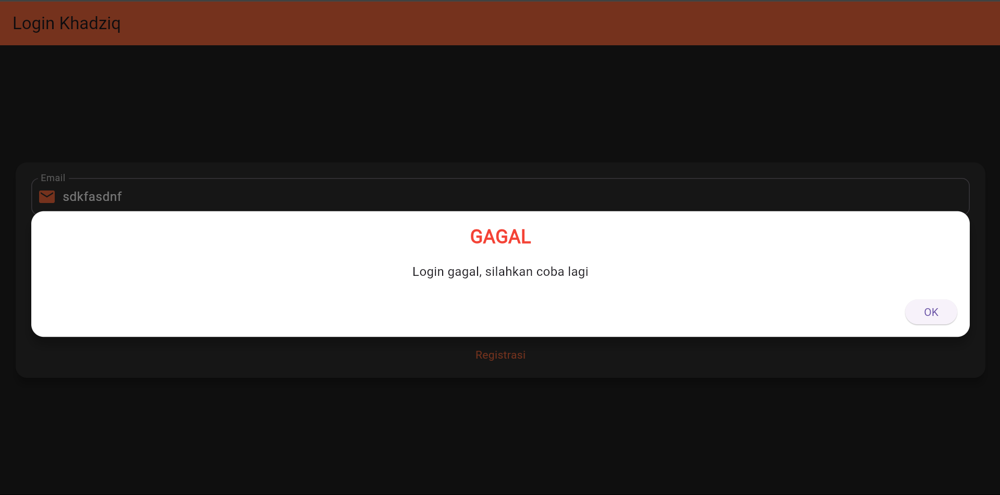
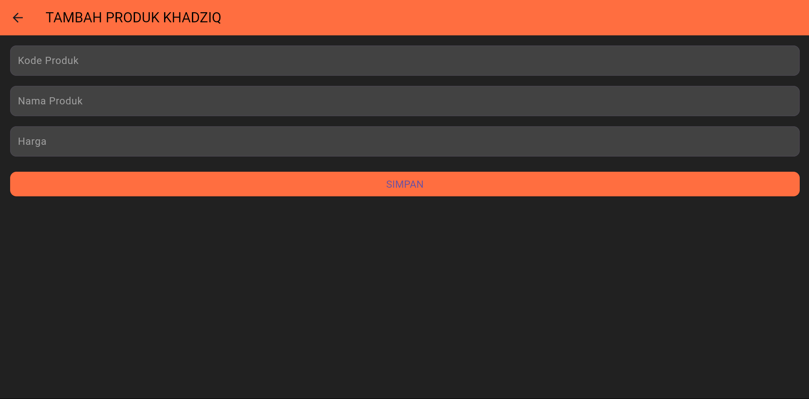

# Panduan Penggunaan Aplikasi - Toko Kita

## Table of Contents
- [Proses Login](#proses-login)
- [Proses Tambah Data Produk (Create)](#proses-tambah-data-produk)
- [Proses Tampil Data Produk (Read)](#proses-tampil-data-produk)
- [Proses Ubah Data Produk (Update)](#proses-ubah-data-produk)
- [Proses Hapus Data Produk (Delete)](#proses-hapus-data-produk)

---

## Proses Login

### a. Menginputkan Username dan Password
Pada halaman login, pengguna diminta untuk memasukkan **username** dan **password**. Berikut adalah tampilan form login:



Form ini mengandung dua elemen penting: field untuk **username/email** dan **password**. Setelah pengguna memasukkan data, mereka dapat menekan tombol **Login** untuk memulai proses autentikasi.

**Kode Form Login**:
```dart
Widget _buildLoginForm() {
  return Column(
    children: [
      TextFormField(
        decoration: InputDecoration(
          labelText: 'Email',
          prefixIcon: Icon(Icons.email),
        ),
        controller: _emailController,
        validator: (value) {
          if (value!.isEmpty) return 'Email harus diisi';
          return null;
        },
      ),
      TextFormField(
        decoration: InputDecoration(
          labelText: 'Password',
          prefixIcon: Icon(Icons.lock),
        ),
        obscureText: true,
        controller: _passwordController,
        validator: (value) {
          if (value!.isEmpty) return 'Password harus diisi';
          return null;
        },
      ),
      ElevatedButton(
        onPressed: _submitLogin,
        child: Text("Login"),
      ),
    ],
  );
}
```
### b. PopUp Berhasil/Tidak Berhasil
Jika login berhasil, pengguna akan diarahkan ke halaman dashboard. Jika gagal, popup notifikasi akan muncul di layar yang memberitahukan kesalahan login, seperti berikut:



**Kode untuk validasi dan login:**

```dart
Salin kode
void _submitLogin() {
  final isValid = _formKey.currentState!.validate();
  if (!isValid) return;

  AuthService.login(_emailController.text, _passwordController.text).then((result) {
    if (result) {
      Navigator.pushReplacementNamed(context, '/dashboard');
    } else {
      showDialog(
        context: context,
        builder: (context) => AlertDialog(
          title: Text("Login Gagal"),
          content: Text("Username atau Password salah."),
        ),
      );
    }
  });
}
```
## Proses Tambah Data Produk
### a. Menampilkan Form Tambah Produk
Untuk menambahkan data produk, pengguna dapat membuka halaman Tambah Produk di mana mereka akan mengisi beberapa informasi penting seperti Nama Produk, Harga, dan Deskripsi.



Kode untuk Form Tambah Produk:

```dart
Widget _buildAddProductForm() {
  return Column(
    children: [
      TextFormField(
        decoration: InputDecoration(
          labelText: 'Nama Produk',
        ),
        controller: _nameController,
      ),
      TextFormField(
        decoration: InputDecoration(
          labelText: 'Harga',
        ),
        controller: _priceController,
        keyboardType: TextInputType.number,
      ),
      TextFormField(
        decoration: InputDecoration(
          labelText: 'Deskripsi',
        ),
        controller: _descriptionController,
        maxLines: 3,
      ),
      ElevatedButton(
        onPressed: _submitProduct,
        child: Text("Tambah Produk"),
      ),
    ],
  );
}
```
### b. Proses Penyimpanan ke Database
Setelah menekan tombol Tambah Produk, data yang diinputkan akan disimpan ke dalam database menggunakan fungsi berikut.

Kode untuk Proses Tambah Produk:

dart
Salin kode
void _submitProduct() {
  final product = Product(
    name: _nameController.text,
    price: double.parse(_priceController.text),
    description: _descriptionController.text,
  );
  
  ProductService.addProduct(product).then((_) {
    showDialog(
      context: context,
      builder: (context) => AlertDialog(
        title: Text("Sukses"),
        content: Text("Produk berhasil ditambahkan."),
      ),
    );
  });
}
Proses Tampil Data Produk
a. Menampilkan List Produk
Pada halaman Dashboard atau List Produk, semua produk yang telah ditambahkan ditampilkan dalam bentuk list yang dapat di-scroll.


Kode untuk Menampilkan List Produk:

dart
Salin kode
Widget _buildProductList() {
  return FutureBuilder<List<Product>>(
    future: ProductService.getProducts(),
    builder: (context, snapshot) {
      if (snapshot.connectionState == ConnectionState.waiting) {
        return Center(child: CircularProgressIndicator());
      } else if (snapshot.hasError) {
        return Center(child: Text('Error: ${snapshot.error}'));
      } else {
        final products = snapshot.data!;
        return ListView.builder(
          itemCount: products.length,
          itemBuilder: (context, index) {
            final product = products[index];
            return ListTile(
              title: Text(product.name),
              subtitle: Text("Harga: ${product.price}"),
              trailing: IconButton(
                icon: Icon(Icons.delete),
                onPressed: () => _deleteProduct(product.id),
              ),
            );
          },
        );
      }
    },
  );
}
Proses Ubah Data Produk
a. Menampilkan Form Edit Produk
Pengguna dapat memilih produk yang ingin diubah dengan menekan tombol Edit pada list produk, yang akan membawa mereka ke halaman Edit Produk.


Kode untuk Form Edit Produk:

dart
Salin kode
Widget _buildEditProductForm(Product product) {
  _nameController.text = product.name;
  _priceController.text = product.price.toString();
  _descriptionController.text = product.description;
  
  return Column(
    children: [
      TextFormField(
        decoration: InputDecoration(labelText: 'Nama Produk'),
        controller: _nameController,
      ),
      TextFormField(
        decoration: InputDecoration(labelText: 'Harga'),
        controller: _priceController,
        keyboardType: TextInputType.number,
      ),
      TextFormField(
        decoration: InputDecoration(labelText: 'Deskripsi'),
        controller: _descriptionController,
        maxLines: 3,
      ),
      ElevatedButton(
        onPressed: () => _updateProduct(product.id),
        child: Text("Simpan Perubahan"),
      ),
    ],
  );
}
b. Proses Update Data ke Database
Setelah menekan tombol Simpan Perubahan, data produk akan diperbarui di database.

Kode untuk Proses Ubah Produk:

dart
Salin kode
void _updateProduct(int productId) {
  final updatedProduct = Product(
    id: productId,
    name: _nameController.text,
    price: double.parse(_priceController.text),
    description: _descriptionController.text,
  );
  
  ProductService.updateProduct(updatedProduct).then((_) {
    showDialog(
      context: context,
      builder: (context) => AlertDialog(
        title: Text("Sukses"),
        content: Text("Produk berhasil diubah."),
      ),
    );
  });
}
Proses Hapus Data Produk
a. Menghapus Produk dari List
Pada halaman List Produk, pengguna dapat menghapus produk dengan menekan ikon Hapus pada list item produk.


Kode untuk Hapus Produk:

dart
Salin kode
void _deleteProduct(int productId) {
  ProductService.deleteProduct(productId).then((_) {
    setState(() {
      // Memperbarui tampilan setelah penghapusan
    });
    showDialog(
      context: context,
      builder: (context) => AlertDialog(
        title: Text("Sukses"),
        content: Text("Produk berhasil dihapus."),
      ),
    );
  });
}
